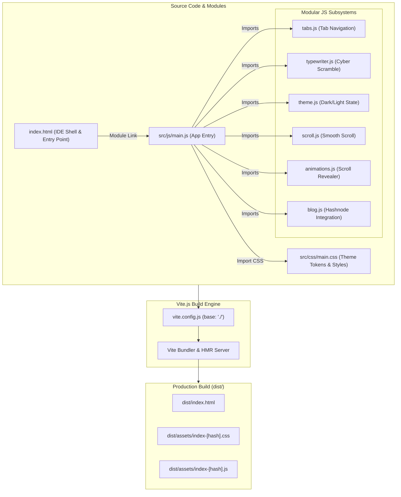

# Dursun Ozgur Cakirkaya | Personal Portfolio

A sleek, interactive personal portfolio engineered to resemble a modern Code Editor (IDE). Built to highlight my expertise as a Web3 & Blockchain Technical Support Engineer.

## ✨ Features

- **IDE/Terminal UI**: A fully immersive developer aesthetic. Horizontal VS Code style tabs (`about_me.md`, `impact_metrics.json`, `skills_stack.json`, `experience.js`), and custom macOS terminal window blocks for metrics and skills.
- **Dynamic Cyber Scramble**: A 30FPS text decoding animation built in pure JavaScript that cycles through technical titles.
- **Tech Grid Design**: A sleek CSS grid background with a floating accent orb and automatic Light/Dark mode toggling.
- **Vite Bundler**: Optimized with ES Modules, hot-module replacement, and distinct JS components.

## 🚀 Local Development

1. Clone the repository and install dependencies:
   ```bash
   git clone https://github.com/obscureozy/obscureozy.github.io.git
   cd obscureozy.github.io
   npm install
   ```

2. Start the local server:
   ```bash
   npm run dev
   ```

3. Open [http://localhost:5173](http://localhost:5173).

## 🧱 Key Project Structure & Schematic

### 📐 Architecture Schematic



### 📁 Directory Tree

```
persona-website/
├── index.html              # Main IDE Layout, Tab Container & Vite Entry Point
├── vite.config.js          # Vite Configuration (Relative Base Path for GitHub Pages)
├── package.json            # npm Dependencies, Scripts ("type": "module")
├── favicon.svg             # Favicon Asset
├── public/                 # Static Assets (Served as-is)
├── .github/
│   └── workflows/
│       ├── ci.yml          # GitHub Actions Continuous Integration (Build Verification)
│       └── deploy.yml      # GitHub Actions Continuous Deployment (GitHub Pages)
├── .circleci/
│   └── config.yml          # CircleCI Automated Pipeline Configuration
└── src/
    ├── css/
    │   └── main.css        # Core Design System, CSS Variables, & IDE Styling
    └── js/
        ├── main.js         # Central Entry Point (Initializes all modules)
        ├── tabs.js         # Horizontal Tab Switching Logic
        ├── typewriter.js   # Cyber Scramble Animation Logic
        ├── theme.js        # Light/Dark Theme Switcher & Persistence
        ├── scroll.js       # Scroll-to-Top Button & Indicators
        ├── animations.js   # Dynamic Scroll Animations
        └── blog.js         # Hashnode GraphQL API Integration
```

## ⚡ Vite.js Build Structure & Architecture

This application leverages **[Vite.js](https://vitejs.dev/)** as a fast, modern frontend build tool. Here is how the project architecture is structured under Vite:

1. **HTML-First Entry Point**: Unlike traditional bundlers that start from a JavaScript file, Vite treats `index.html` as the root entry point. The `<script type="module" src="/src/js/main.js"></script>` tag informs Vite where the application logic begins.
2. **Native ES Modules (ESM)**: JavaScript modules use native `import`/`export` statements. During development (`npm run dev`), Vite serves source files directly over native ESM without pre-bundling, delivering instant server start and lightning-fast Hot Module Replacement (HMR).
3. **Integrated Asset & CSS Bundling**: The CSS file (`main.css`) is imported directly in `main.js`. Vite parses this import, injects styles during development, and optimizes/minifies them into single CSS output chunks during production build.
4. **Production Build (`npm run build`)**: Vite uses Rollup to compile all modules into static production bundles in the `dist/` directory. With `base: './'` configured in `vite.config.js`, all output assets use relative links, making the site ready for GitHub Pages hosting.

## 🔄 CI/CD & Pipeline Automation

The repository features automated Continuous Integration (CI) and Continuous Deployment (CD) workflows across both **GitHub Actions** and **CircleCI**:

### 🛠️ 1. Continuous Integration (`.github/workflows/ci.yml`)
- **Trigger**: Every `push` or `pull_request` targeting the `main` branch, plus manual `workflow_dispatch`.
- **Process**:
  1. Checks out source code using `actions/checkout@v4`.
  2. Sets up Node.js 20 runtime with `actions/setup-node@v4` and `npm` dependency caching.
  3. Executes a clean dependency installation (`npm ci`).
  4. Runs `npm run build` to verify production compilation and catch syntax or bundling regressions before merging.

### 🚀 2. Automated GitHub Pages Deployment (`.github/workflows/deploy.yml`)
- **Trigger**: Pushes to the `main` branch.
- **Process**:
  1. Compiles production assets (`dist/`) via Node 20.
  2. Bundles the output into a GitHub Pages artifact using `actions/upload-pages-artifact@v3`.
  3. Deploys the static bundle automatically to the live site hosting environment using `actions/deploy-pages@v4`.

### ⭕ 3. CircleCI Pipeline Integration (`.circleci/config.yml`)
- **Environment**: CircleCI Node 20 Docker container (`cimg/node:20.18.0`).
- **Optimization**: Caches `node_modules` keyed by `package-lock.json` hash to accelerate build speeds.
- **Process**: Automates dependency installation (`npm ci`) and build validation (`npm run build`) for seamless cross-platform CI monitoring.

## 📜 License
MIT License.

## 📬 Contact
- GitHub: [@obscureozy](https://github.com/obscureozy)
- LinkedIn: [Dursun Ozgur Cakirkaya](https://www.linkedin.com/in/dursun-ozgur-cakirkaya/)
